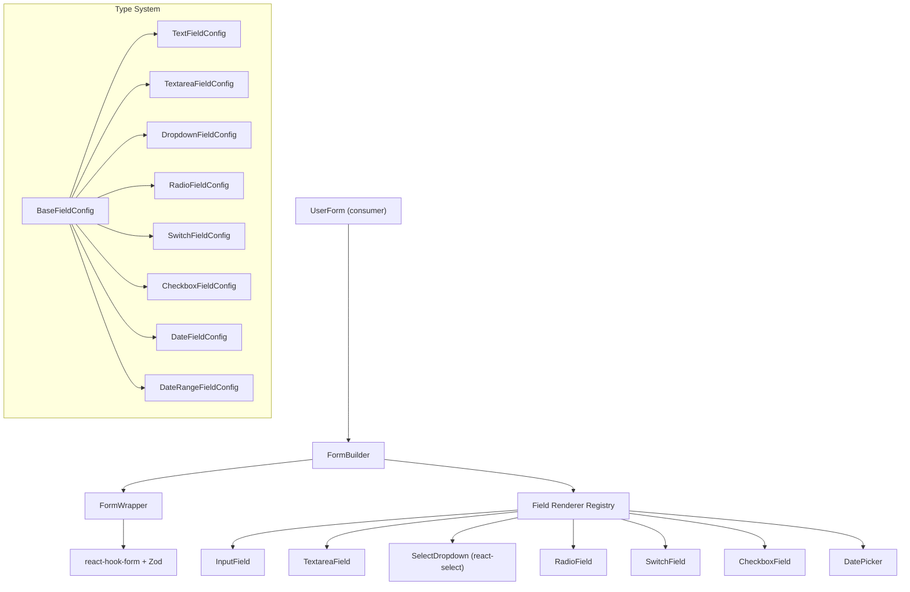

# Form Builder Architecture Redesign

## Current Problems

- `**any` everywhere**: `FormWrapper` props (`data: any`, `schema: any`), `FormBuilder` props, `SelectDropdown` options, error handlers -- violates strict TS rules
- **Flat field type**: `FormBuilderType` is one big flat type where every prop is optional -- no compile-time guarantee that a `dropdown` field has `options`/`api`, or that `date` has `dateFormat`
- **If-chain rendering**: `renderInput` in `form-builder.tsx` is a growing if-chain -- adding a new field type means modifying the builder itself
- **Duplicate SelectDropdown**: `select-dropdown.tsx` and `select-dropdown-2.tsx` serve overlapping purposes
- **Switch broken pattern**: `switch.tsx` manages its own `useState` instead of using `Controller` from react-hook-form, causing sync issues
- **Repeated error helper**: Every field component copy-pastes the same `getErrorMessage` function
- **Checkbox not in builder**: `checkbox-field.tsx` exists but isn't wired into FormBuilder

## Architecture Overview




## File Changes

### 1. Rewrite type system with discriminated unions -- [form-builder-type.ts](components/form-wrapper/form-builder-type.ts)

Replace the single flat `FormBuilderType` with a discriminated union. Each variant carries only the props relevant to that field type.

```typescript
type BaseFieldConfig = {
  name: string;
  label?: LabelProps;
  placeholder?: string;
  permission?: boolean;
  className?: string;
  order?: number;
};

type TextFieldConfig = BaseFieldConfig & {
  type: "text" | "email" | "password" | "number";
};

type DropdownFieldConfig = BaseFieldConfig & {
  type: "dropdown";
  api?: string;
  options?: SelectOption[];
  isMulti?: boolean;
  isSearchable?: boolean;
  isClearable?: boolean;
  isDisabled?: boolean;
  valueKey?: string;
  valueMapping?: ValueMapping;
};

// ... one per field type

type FieldConfig =
  | TextFieldConfig
  | TextareaFieldConfig
  | DropdownFieldConfig
  | RadioFieldConfig
  | SwitchFieldConfig
  | CheckboxFieldConfig
  | DateFieldConfig
  | DateRangeFieldConfig;
```

Also add a reusable `SelectOption` type and export a `LabelProps` (renamed from `labelProps` for convention).

### 2. Add generic typing to FormWrapper -- [form-wrapper.tsx](components/form-wrapper/form-wrapper.tsx)

- Make `FormWrapper` generic over the Zod schema: `FormWrapper<TSchema extends z.ZodType>`
- Type `data` as `Partial<z.infer<TSchema>> | undefined`
- Type `schema` as `TSchema`
- Replace `mode` string with literal union `"create" | "edit"`
- Replace `method` string with `"GET" | "POST" | "PUT"`
- Remove all `any` from `onSubmit`, `onError`, mutation callbacks

### 3. Refactor FormBuilder with field registry -- [form-builder.tsx](components/form-wrapper/form-builder.tsx)

- Extract `renderInput` if-chain into a `FIELD_RENDERERS` record keyed by field type
- Use `FieldConfig` discriminated union so each renderer receives the correctly narrowed type
- Make `FormBuilder` generic, passing the Zod schema type through to `FormWrapper`
- Type `formSchema` as `FieldConfig[]` (or `AccordionSection[]` when `accordion=true`)
- Remove `console.log` calls
- Remove the `useEffect` that invalidates `show_header` on every render (performance bug)
- Extract `gridStyle` map to a shared constant (also used in `form-filter.tsx`)

**Field registry pattern:**

```typescript
const FIELD_RENDERERS: Record<FieldConfig["type"], (field: FieldConfig) => ReactNode> = {
  text: (f) => <InputField {...(f as TextFieldConfig)} />,
  email: (f) => <InputField {...(f as TextFieldConfig)} />,
  password: (f) => <InputField {...(f as TextFieldConfig)} />,
  number: (f) => <InputField {...(f as TextFieldConfig)} />,
  textarea: (f) => <TextareaField {...(f as TextareaFieldConfig)} />,
  dropdown: (f) => <SelectDropdown {...(f as DropdownFieldConfig)} />,
  radio: (f) => <RadioField {...(f as RadioFieldConfig)} />,
  switch: (f) => <SwitchField {...(f as SwitchFieldConfig)} />,
  checkbox: (f) => <CheckboxField {...(f as CheckboxFieldConfig)} />,
  date: (f) => <DatePicker {...(f as DateFieldConfig)} mode="single" />,
  dateRange: (f) => <DatePicker {...(f as DateRangeFieldConfig)} mode="range" />,
};

// Usage in render
const renderField = (field: FieldConfig) => FIELD_RENDERERS[field.type]?.(field) ?? null;
```

Adding a new field type becomes: add a union variant + add one renderer entry. No builder modifications.

### 4. Consolidate SelectDropdown -- [select-dropdown.tsx](components/select-dropdown.tsx)

Merge `select-dropdown.tsx` and `select-dropdown-2.tsx` into one component:

- Keep React Query-based API fetching from `select-dropdown.tsx` (cleaner)
- Add dark-mode-aware theming from `select-dropdown-2.tsx` (using `classNames` unstyled approach)
- Accept `api?: string` -- when provided, fetch options from API via React Query
- Accept `options?: SelectOption[]` -- used as fallback when no `api`
- Type options as `SelectOption[]` (no `any`)
- Support `isMulti`, `isClearable`, `isSearchable`, `isDisabled`
- Use `Controller` from react-hook-form instead of manual `watch`/`setValue` for proper form integration
- Delete `select-dropdown-2.tsx` after merge

### 5. Fix Switch to use Controller -- [switch.tsx](components/form/switch.tsx)

Replace manual `useState` + `useEffect` + `setValue` with react-hook-form `Controller`. Current implementation:

- Has a local `enabled` state that can desync from form state
- Calls `setValue` in a `useEffect` (anti-pattern)

New implementation: single `Controller` wrapping `ShadcnSwitch`, matching the pattern used by all other field components.

### 6. Extract shared error helper -- [form-builder-type.ts](components/form-wrapper/form-builder-type.ts) or a new util

Every field component (`input-field`, `textarea-field`, `radio-field`, `checkbox-field`) duplicates the same `getErrorMessage` function. Extract it once:

```typescript
function FieldError({ name }: { name: string }) {
  const { formState: { errors } } = useFormContext();
  const error = errors[name];
  if (!error) return null;
  return <p className="text-sm text-destructive mt-1">{error.message?.toString()}</p>;
}
```

Then use `<FieldError name={name} />` in every field component, replacing 6 copies of the same logic.

### 7. Update field components to use LabelProps consistently

- [input-field.tsx](components/form/input-field.tsx): Remove `validationSchema` prop (Zod handles validation via FormWrapper), use `LabelProps`, use `FieldError` component
- [textarea-field.tsx](components/form/textarea-field.tsx): Same cleanup
- [radio-field.tsx](components/form/radio-field.tsx): Same cleanup
- [checkbox-field.tsx](components/form/checkbox-field.tsx): Update to use `LabelProps` object (currently uses raw string)
- [DatePicker.tsx](components/form/DatePicker.tsx): Already clean, minor `LabelProps` rename alignment

### 8. Update user form schema as migration example -- [user-form-schema.ts](components/users/user-form-schema.ts)

Update to use the new `FieldConfig` discriminated union. The structure stays nearly identical -- just the type import changes and the compiler will now enforce that each field variant has the correct props.

### 9. Update UserForm consumer -- [user-form.tsx](components/users/user-form.tsx)

- Type `method` prop as `"GET" | "POST" | "PUT"` instead of string
- Type `mode` as `"create" | "edit"`
- Pass `UserSchema` type through generics

### 10. Delete select-dropdown-2.tsx -- [select-dropdown-2.tsx](components/select-dropdown-2.tsx)

After merging into `select-dropdown.tsx`, delete this file. Update any imports (check `form-filter.tsx` and other consumers).

## Folder Structure (no changes needed)

The current structure already follows your `.cursor/rules/components.mdc` grouping principles:

```
components/
  form-wrapper/
    form-builder-type.ts    # Type system (discriminated unions)
    form-builder.tsx         # FormBuilder + field registry
    form-wrapper.tsx         # FormWrapper (react-hook-form + submission)
    form-filter.tsx          # Filter variant (shares grid utils)
  form/
    input-field.tsx          # Text/email/password/number
    textarea-field.tsx       # Textarea
    DatePicker.tsx           # Date + DateRange
    radio-field.tsx          # Radio groups
    switch.tsx               # Boolean toggle
    checkbox-field.tsx       # Single + multi checkbox
  select-dropdown.tsx        # Consolidated dropdown (api + static)
  label.tsx                  # Shared label with tooltip
  users/
    user-form-schema.ts      # FieldConfig[] definition
    user-form.tsx            # Consumer component
  schema/
    user.ts                  # Zod validation schema
```

## Edge Cases Addressed

- **Edit mode**: `transformDataToFormValues` already handles relational data extraction via `valueKey`/`valueMapping` -- this is preserved and properly typed
- **Conditional fields**: `permission` boolean controls visibility; password fields set `permission: mode === "create"` -- pattern preserved
- **Default values**: Each Zod schema defines `.default()` and `.optional()` -- form data flows through `FormWrapper` defaultValues
- **Save-on-change**: Switch/toggle fields can trigger immediate submission via `saveOnChange` callback -- preserved in the new Switch using Controller

