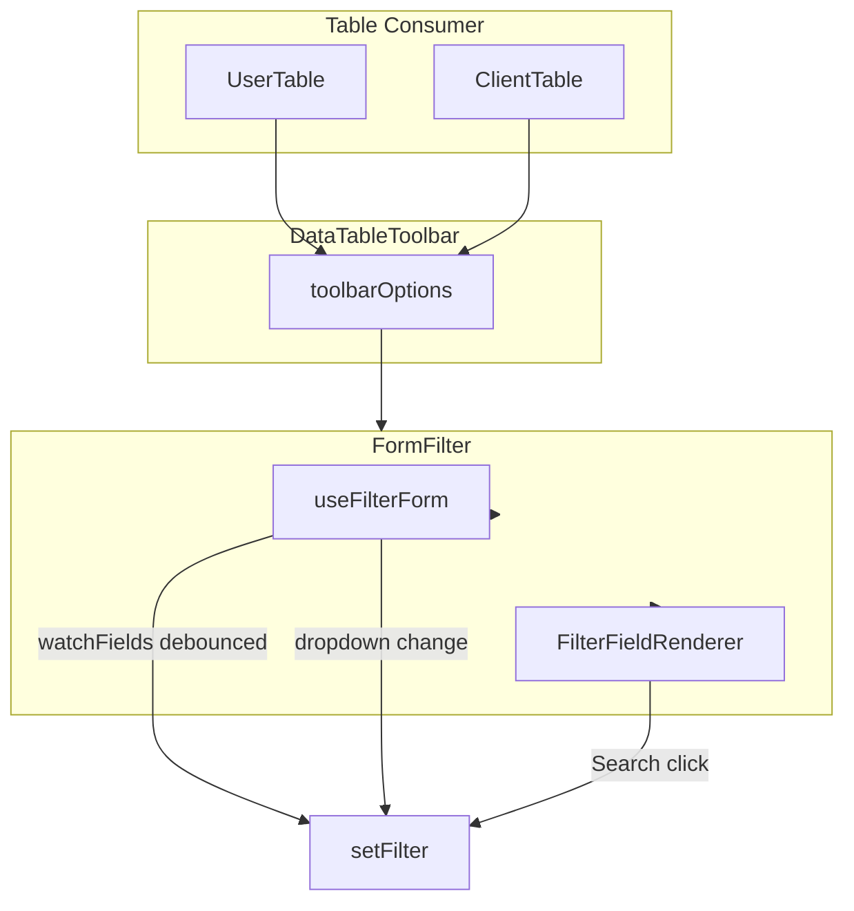

# Reusable Filter Component Plan

## Current State Analysis

**FormFilter** ([form-filter.tsx](c:\wamp64\www\shadcn-isp-client\components\form-wrapper\form-filter.tsx)) currently:

- Supports text, email, number, and dropdown fields via `formSchema` (FieldConfig[])
- Uses `watchField` (typo: should be plural) to auto-trigger on length > 2 or === 0
- Shows Search button when `searchButton` is true
- Dropdowns trigger via `onValueChange` → submit
- No debounce on text fields (causes excessive API calls)
- `watchField` is hardcoded in [data-table-toolbar.tsx](c:\wamp64\www\shadcn-isp-client\components\data-table\data-table-toolbar.tsx) as `["name", "email", "username"]` instead of being schema-driven

**Data flow:**

```
UserTable/ClientTable → toolbarOptions.filter (schema) + setFilter
  → DataTableToolbar → FormFilter (formSchema, watchField, searchButton)
  → objectToQueryString → setFilter(queryString) → useApiQuery params
```

## Requirements Mapping


| Requirement                         | Current                               | Target                                                      |
| ----------------------------------- | ------------------------------------- | ----------------------------------------------------------- |
| watchFields auto-trigger at 3 chars | Partial (no debounce)                 | Add 300–400ms debounce                                      |
| Non-watchFields need Search button  | Search shows for all when enabled     | Show Search only when text fields exist outside watchFields |
| Dropdowns trigger immediately       | Yes                                   | Keep                                                        |
| Theme-compatible                    | Yes (Tailwind + vars)                 | Ensure no hard-coded colors/sizes                           |
| No hard-coded CSS                   | Minor: `top-1`, `p-2` in clear button | Use Tailwind spacing tokens                                 |
| Extensible structure                | Monolithic                            | Extract hooks and render logic                              |


---

## Implementation Plan

### 1. Extend FieldConfig for Schema-Level watchFields (Optional)

In [form-builder-type.ts](c:\wamp64\www\shadcn-isp-client\components\form-wrapper\form-builder-type.ts), add optional `watchForFilter?: boolean` to `TextFieldConfig`:

```typescript
export type TextFieldConfig = BaseFieldConfig & {
  type: "text" | "email" | "password" | "number";
  watchForFilter?: boolean;  // when true, auto-triggers filter at 3 chars
};
```

This allows schemas to declare which fields auto-trigger without passing a separate array. Tables can still override via `watchFields` prop.

### 2. Create useFilterForm Hook

Extract filter logic into `hooks/use-filter-form.ts`:

- Form instance, `getQueryString`, `submitFilter` (trigger)
- Debounced watch subscription for `watchFields` (300–400ms)
- Logic: text in watchFields → debounce → submit when length >= 3 or === 0
- Dropdowns: call `submitFilter` directly in `onValueChange` (no debounce)
- Derive `hasManualSearchFields`: text/email/number fields not in watchFields

### 3. Refactor FormFilter Component

**Props interface** (aligned with requirements):

```typescript
type FormFilterProps = {
  formSchema: FieldConfig[];
  setFilter?: (query: string) => void;
  watchFields?: string[];           // renamed, auto-trigger at 3 chars
  grids?: number;
  gridGap?: string;
  defaultFilter?: string;
  searchButton?: boolean;            // show Search when hasManualSearchFields
  showFilter?: boolean;
  setShowFilter?: (show: boolean) => void;
};
```

**watchFields resolution:**

- If `watchFields` prop provided → use it
- Else derive from schema: fields with `watchForFilter === true`
- Fallback: `[]` (all text fields require Search)

**Behavior:**

- **watchFields text inputs:** debounced (e.g. 400ms), submit when length >= 3 or === 0
- **Non-watchFields text inputs:** no auto-submit; Search button triggers submit
- **Dropdowns:** submit immediately on change (unchanged)
- **Search button:** visible when `searchButton && hasManualSearchFields`; if all text fields are in watchFields, hide Search

**Styling:**

- Replace `top-1`, `p-2` with Tailwind tokens: `top-1` → `top-1` (0.25rem), `p-2` → `p-2` (0.5rem) — these are already Tailwind; ensure no `style={{}}` or literal px values
- Use `text-muted-foreground`, `cursor-pointer`, etc. (already theme tokens)
- No inline `style` attributes; all via `className` and `cn()`

### 4. Update SelectDropdown Integration

[select-dropdown.tsx](c:\wamp64\www\shadcn-isp-client\components\select-dropdown.tsx) uses react-select `styles` with `hsl(var(--*))` — already theme-compatible. No changes required unless moving to CSS modules; that would be a larger refactor. For this task, keep as-is.

### 5. Update DataTableToolbar Integration

In [data-table-toolbar.tsx](c:\wamp64\www\shadcn-isp-client\components\data-table\data-table-toolbar.tsx):

- Pass `watchFields` from `toolbarOptions.watchFields` if provided
- Otherwise derive from schema (fields with `watchForFilter`) or use `["username", "email"]` as default for backward compatibility
- Ensure `searchButton` is passed (e.g. `true` when filter schema has text fields)

```tsx
<FormFilter
  formSchema={toolbarOptions.filter}
  grids={toolbarOptions?.filter?.length}
  setFilter={setFilter}
  watchFields={toolbarOptions?.watchFields ?? ["username", "email"]}
  searchButton
  setShowFilter={setShowFilter}
/>
```

### 6. Update Filter Schemas (Optional)

In [user-filter-schema.ts](c:\wamp64\www\shadcn-isp-client\components\users\user-filter-schema.ts) and [client-filter-schema.ts](c:\wamp64\www\shadcn-isp-client\components\clients\client-filter-schema.ts), add `watchForFilter: true` to username and email:

```typescript
{ type: "text", name: "username", watchForFilter: true, ... },
{ type: "text", name: "email", watchForFilter: true, ... },
```

This makes the schema self-describing; toolbar can omit `watchFields` and derive from schema.

### 7. Component Structure (Separation of Concerns)

```
form-filter/
  form-filter.tsx          # Main component, orchestration
  filter-field-renderer.tsx # renderField logic (text, dropdown)
  use-filter-form.ts       # Form + debounce + submit logic (in hooks/)
```

Or keep in single file per project rules (group related components). Given the component modularization rule ("group related components together"), keeping `FormFilter` and `FilterFieldRenderer` in `form-filter.tsx` is acceptable. Move `useFilterForm` to `hooks/use-filter-form.ts` for reuse.

---

## File Changes Summary


| File                                                                                                   | Action                                                                |
| ------------------------------------------------------------------------------------------------------ | --------------------------------------------------------------------- |
| [form-builder-type.ts](c:\wamp64\www\shadcn-isp-client\components\form-wrapper\form-builder-type.ts)   | Add `watchForFilter?: boolean` to TextFieldConfig                     |
| [hooks/use-filter-form.ts](c:\wamp64\www\shadcn-isp-client\hooks\use-filter-form.ts)                   | New: form logic, debounce, watchFields handling                       |
| [form-filter.tsx](c:\wamp64\www\shadcn-isp-client\components\form-wrapper\form-filter.tsx)             | Refactor: use hook, fix watchFields, Search visibility, Tailwind-only |
| [data-table-toolbar.tsx](c:\wamp64\www\shadcn-isp-client\components\data-table\data-table-toolbar.tsx) | Pass watchFields from toolbarOptions, fix prop name                   |
| [user-filter-schema.ts](c:\wamp64\www\shadcn-isp-client\components\users\user-filter-schema.ts)        | Add watchForFilter to username, email                                 |
| [client-filter-schema.ts](c:\wamp64\www\shadcn-isp-client\components\clients\client-filter-schema.ts)  | Add watchForFilter to username, email                                 |


---

## Data Flow (After)




---

## Backward Compatibility

- `watchField` → `watchFields` (plural) with same semantics
- Existing `toolbarOptions.filter` unchanged
- Default `watchFields` from schema or `["username", "email"]` keeps current behavior
- `searchButton` continues to show when manual-search fields exist

---

## Out of Scope (Per Requirements)

- Checkbox and radio filters (excluded)
- Date/dateRange filters (can be added later using same pattern)

