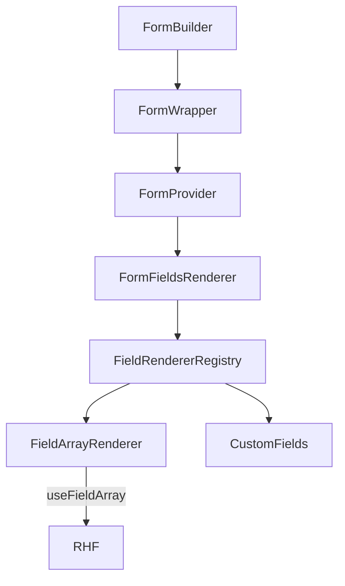

## Goals

- Add **schema-driven dynamic arrays** using React Hook Form `useFieldArray` (append/remove/reorder) with stable keys.
- Ensure **create vs edit** behaves consistently (default values, hydration, reset).
- Keep **backward compatibility**: existing `FieldConfig[]` / `AccordionSection[]` schemas and current screens keep working.
- Improve **separation of concerns**: `FormBuilder` owns composition + RHF wiring; custom fields remain reusable and receive RHF props cleanly.

## Current state (key constraints)

- `FormBuilder` renders by type/name only and uses index keys:

```150:270:C:\wamp64\www\shadcn-isp-client\components\form-wrapper\form-builder.tsx
  const FIELD_RENDERERS: Record<FieldConfig["type"], (f: FieldConfig) => ReactNode> = {
    text: (f) => <InputField name={f.name} label={f.label} placeholder={f.placeholder} type={f.type} />,
    // ...
  };

  return (
    <FormWrapper /* ... */>
      {children ? (
        children(renderField)
      ) : (
        <div className={`grid ${gridGap} m-auto ${GRID_STYLES[grids]} w-full`}>
          {(formSchema as FieldConfig[]).map((field, index) => (
            <div key={index}>
              {field.permission !== false ? renderField(field) : null}
            </div>
          ))}
        </div>
      )}
    </FormWrapper>
  );
```

- Custom fields are tightly coupled to RHF context and check errors via `errors[name]` (breaks for nested/array paths like `items.0.name`):

```23:45:C:\wamp64\www\shadcn-isp-client\components\form\input-field.tsx
    const { control, formState: { errors } } = useFormContext();
    // ...
    <Input
      // ...
      className={cn(errors[name] && "border-destructive dark:border-destructive")}
    />
    <FieldError name={name} />
```

## Design

### 1) Extend schema types (backwards-compatible)

- Update `[C:\wamp64\www\shadcn-isp-client\components\form-wrapper\form-builder-type.ts](C:\wamp64\www\shadcn-isp-client\components\form-wrapper\form-builder-type.ts)`:
  - Add optional `rules?: RegisterOptions` to `BaseFieldConfig` (RHF validation rules when needed; still compatible with Zod resolver).
  - Add new union variant:
    - `FieldArrayConfig` with `type: "fieldArray"`, `name`, `label?`, `itemFields: FieldConfig[]`, `defaultItem`, and flags like `allowAppend/allowRemove/allowReorder`, `minItems/maxItems`.
  - Export helpers/types needed for renderers (no breaking changes to existing field configs).

### 2) Refactor `FormBuilder` into a provider-aware renderer

- Update `[C:\wamp64\www\shadcn-isp-client\components\form-wrapper\form-builder.tsx](C:\wamp64\www\shadcn-isp-client\components\form-wrapper\form-builder.tsx)`:
  - Keep the existing `FormBuilderProps` API.
  - Move all RHF-hook usage (`useFormContext`, `useFieldArray`) into **child components rendered inside** `FormWrapper`’s `<FormProvider>`.
  - Replace index keys with stable keys: `field.name` for static fields; `fieldArrayItem.id` for arrays.
  - Introduce small, testable units inside the file (or extracted if it grows):
    - `FormFieldsRenderer`: renders `FieldConfig[] | AccordionSection[]`.
    - `renderField(field)`: registry-based renderer that handles both current field types and the new `fieldArray` type.
    - `FieldArrayRenderer`: uses `useFieldArray({ name, control })` and renders each item as a grid section with Add/Remove/Reorder controls.
  - Support nested field names by prefixing item field names:
    - If array name is `contacts` and item field is `phone`, render as `contacts.${index}.phone`.

### 3) Make edit-mode hydration and defaults array-safe

- Update `transformDataToFormValues` in `form-builder.tsx`:
  - Refactor into a **recursive schema-driven transform** that can:
    - Keep existing date/dateRange parsing.
    - Keep existing dropdown valueMapping behavior.
    - Apply the same mapping **inside field arrays** by transforming each item object.
  - Add a schema defaults helper so create/edit always have arrays initialized:
    - If a `fieldArray` is missing in incoming `data`, set it to `[]` (or `minItems` worth of `defaultItem`).
- Update hydration completeness checks in `[C:\wamp64\www\shadcn-isp-client\components\form-wrapper\form-wrapper.tsx](C:\wamp64\www\shadcn-isp-client\components\form-wrapper\form-wrapper.tsx)`:
  - Extend `flattenFields/isDataComplete` to understand `fieldArray` so `hydrateOnEdit="ifNeeded"` doesn’t incorrectly skip hydration when nested array data is partial.

### 4) Update custom field components to accept RHF props + fix nested errors

- Update these components to accept optional RHF props and avoid `errors[name]`:
  - `[C:\wamp64\www\shadcn-isp-client\components\form\input-field.tsx](C:\wamp64\www\shadcn-isp-client\components\form\input-field.tsx)`
  - `[C:\wamp64\www\shadcn-isp-client\components\form\textarea-field.tsx](C:\wamp64\www\shadcn-isp-client\components\form\textarea-field.tsx)`
  - `[C:\wamp64\www\shadcn-isp-client\components\select-dropdown.tsx](C:\wamp64\www\shadcn-isp-client\components\select-dropdown.tsx)`
  - `[C:\wamp64\www\shadcn-isp-client\components\form\checkbox-field.tsx](C:\wamp64\www\shadcn-isp-client\components\form\checkbox-field.tsx)`
  - `[C:\wamp64\www\shadcn-isp-client\components\form\radio-field.tsx](C:\wamp64\www\shadcn-isp-client\components\form\radio-field.tsx)`
  - `[C:\wamp64\www\shadcn-isp-client\components\form\switch.tsx](C:\wamp64\www\shadcn-isp-client\components\form\switch.tsx)`
  - `[C:\wamp64\www\shadcn-isp-client\components\form\DatePicker.tsx](C:\wamp64\www\shadcn-isp-client\components\form\DatePicker.tsx)`
  - `[C:\wamp64\www\shadcn-isp-client\components\form\field-error.tsx](C:\wamp64\www\shadcn-isp-client\components\form\field-error.tsx)`

Implementation approach (backwards-compatible):

- Each field component accepts:
  - `control?: Control<FieldValues>`
  - `rules?: RegisterOptions`
  - (optional) `name`, `label`, etc unchanged
- Internally use `controlProp ?? useFormContext().control`.
- Use `Controller`’s `fieldState.error` (or `getFieldState(name, formState)`) for error UI so nested paths and array indices work reliably.

### 5) Ensure reorder/remove doesn’t corrupt state

- In `FieldArrayRenderer`:
  - Use `fields.map((item, index) => ...)` with `key={item.id}`.
  - Wire controls to `append`, `remove`, `move`.
  - Keep item subfields controlled via the nested `name` prefix strategy.

### 6) Verification

- Confirm existing screens still work unchanged:
  - `[C:\wamp64\www\shadcn-isp-client\components\clients\client-form.tsx](C:\wamp64\www\shadcn-isp-client\components\clients\client-form.tsx)` and other forms using `FormBuilder` / `AccordionFormBuilder`.
- Add one lightweight “fieldArray” usage in a non-critical schema (or a story/dev-only schema) to validate append/remove/reorder + edit hydration.
- Run lints/TypeScript checks on edited files and fix any introduced issues (no `any`).

## Architecture sketch




