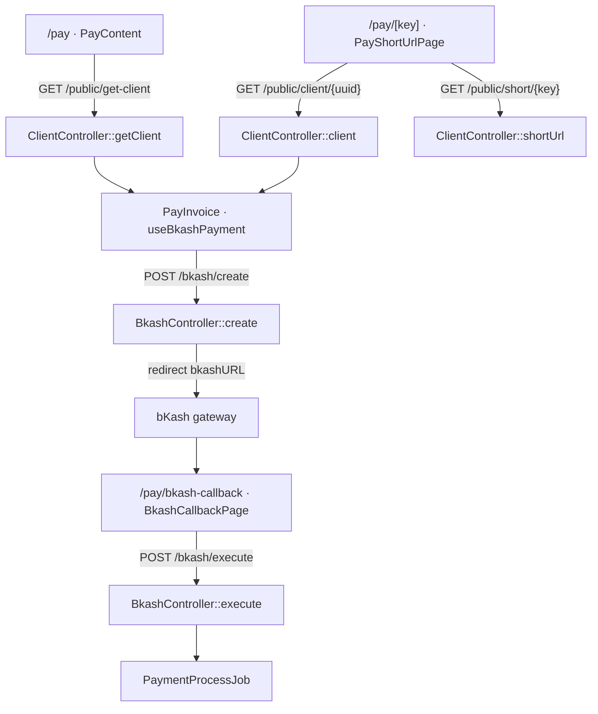
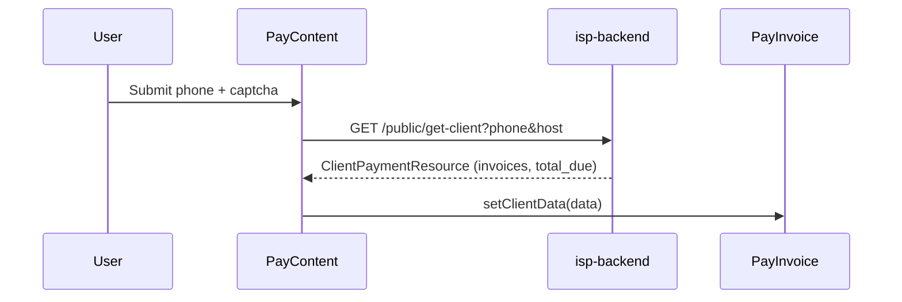
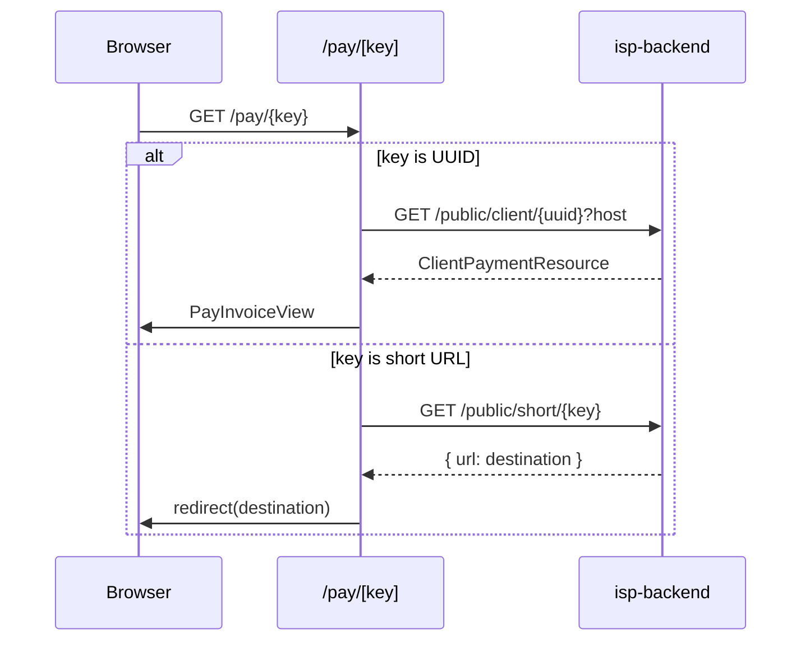
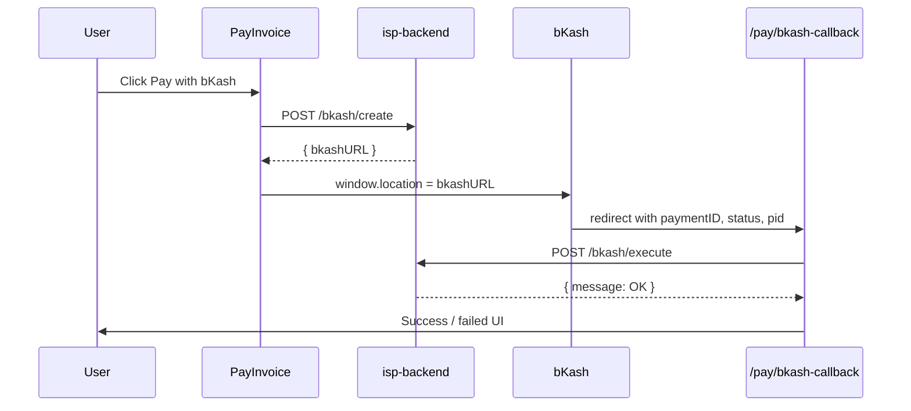

# Pay — Frontend → Backend API Map

Public client payment flow. All requests use `NEXT_PUBLIC_API` as the backend base URL (`/api/v1/...`).

---

## Overview

**Frontend (shadcn-client)**

| Node | Route / component | Source |
|------|-------------------|--------|
| P1 | `/pay` · PayContent | [pay-content.tsx](../components/pay/pay-content.tsx) |
| P2 | `/pay/[key]` · PayShortUrlPage | [page.tsx](../app/(public)/pay/[key]/page.tsx) |
| P3 | `/pay/bkash-callback` · BkashCallbackPage | [page.tsx](../app/(public)/pay/bkash-callback/page.tsx) |
| PI | PayInvoice · useBkashPayment | [pay-invoice.tsx](../components/pay/pay-invoice.tsx) · [use-bkash-payment.ts](../components/bkash-payment/use-bkash-payment.ts) |

**Backend (isp-backend)**

| Node | Method | Source |
|------|--------|--------|
| GC | `ClientController::getClient` | [ClientController.php#L17](../../isp-backend/app/Http/Controllers/V1/Client/ClientController.php#L17) |
| CL | `ClientController::client` | [ClientController.php#L81](../../isp-backend/app/Http/Controllers/V1/Client/ClientController.php#L81) |
| SU | `ClientController::shortUrl` | [ClientController.php#L38](../../isp-backend/app/Http/Controllers/V1/Client/ClientController.php#L38) |
| BC | `BkashController::create` | [BkashController.php#L32](../../isp-backend/app/Http/Controllers/V1/Admin/BkashController.php#L32) |
| BE2 | `BkashController::execute` | [BkashController.php#L84](../../isp-backend/app/Http/Controllers/V1/Admin/BkashController.php#L84) |
| JOB | `PaymentProcessJob` | [PaymentProcessJob.php](../../isp-backend/app/Jobs/PaymentProcessJob.php) |

---

## 1. Phone lookup — `/pay`

User enters phone + captcha, then searches for due invoices.

| Step | Frontend | Backend |
|------|----------|---------|
| Page | `app/(public)/pay/page.tsx` → `components/pay/pay-content.tsx` | — |
| Trigger | Form submit → `fetchClientPayment(phone)` | — |
| Request | `GET /api/v1/public/get-client?phone={phone}&host={hostname}` | `ClientController::getClient` |
| Response | `ClientPaymentResource` → renders `PayInvoice` | Resolves company by `host`, finds client by phone |

---

## 2. Deep link / short URL — `/pay/[key]`

Server-rendered page. UUID loads invoice directly; other keys resolve a short URL redirect.

| Step | Frontend | Backend |
|------|----------|---------|
| Page | `app/(public)/pay/[key]/page.tsx` | — |
| UUID path | `getPublicData('/public/client/{uuid}?host=')` | `ClientController::client` |
| Short key path | `getPublicData('/public/short/{key}')` → redirect | `ClientController::shortUrl` |
| View | `pay-invoice-view.tsx` → `PayInvoice` | Validates `host` matches company domain |

---

## 3. bKash payment

Triggered from `PayInvoice` when user clicks **Pay with bKash**.

| Step | Frontend | Backend |
|------|----------|---------|
| Hook | `components/bkash-payment/use-bkash-payment.ts` → `startPayment()` | — |
| Create | `POST /api/v1/bkash/create` `{ host, id, amount, invoice, callback }` | `BkashController::create` — creates bKash payment, caches client UUID |
| Redirect | Browser → `bkashURL` (external) | — |
| Callback | `/pay/bkash-callback?paymentID&status&pid` | — |
| Execute | `executePayment()` → `POST /api/v1/bkash/execute` `{ paymentID, pid }` | `BkashController::execute` — confirms payment, dispatches `PaymentProcessJob` |

---

## Endpoint reference

| Method | Endpoint | Controller | Auth | Description |
|--------|----------|------------|------|-------------|
| `GET` | `/api/v1/public/get-client` | `ClientController::getClient` | Public | Lookup client + due invoices by phone and company host |
| `GET` | `/api/v1/public/client/{uuid}` | `ClientController::client` | Public | Load client payment data by UUID (deep link) |
| `GET` | `/api/v1/public/short/{key}` | `ClientController::shortUrl` | Public | Resolve short URL key to destination |
| `POST` | `/api/v1/bkash/create` | `BkashController::create` | Public | Initiate bKash payment session |
| `POST` | `/api/v1/bkash/execute` | `BkashController::execute` | Public | Confirm bKash payment and record invoice payment |
